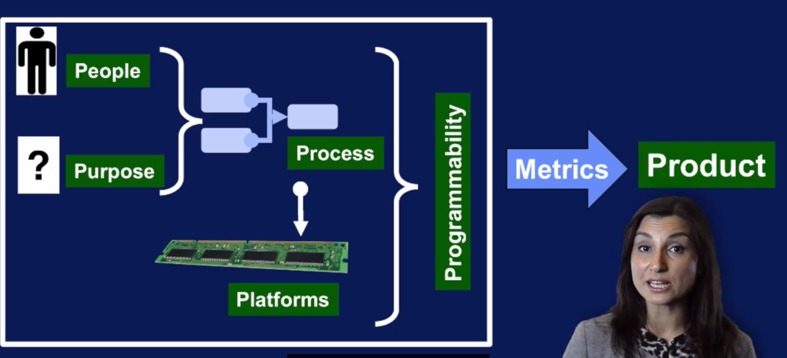
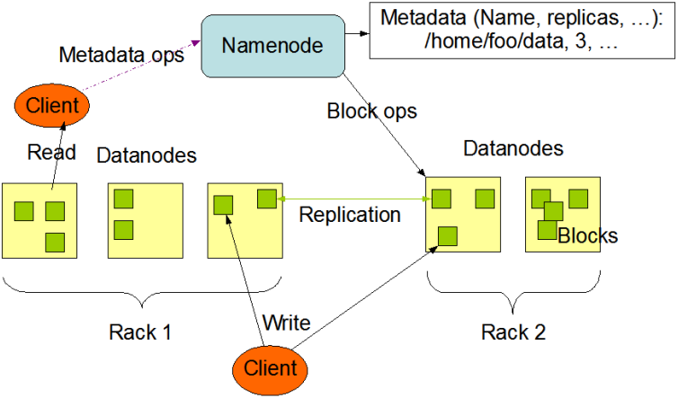
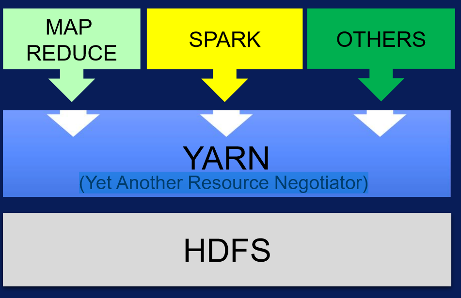
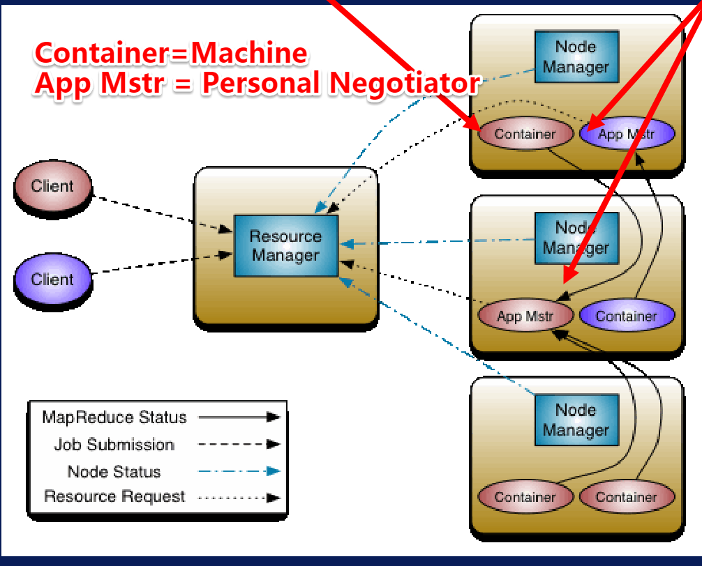
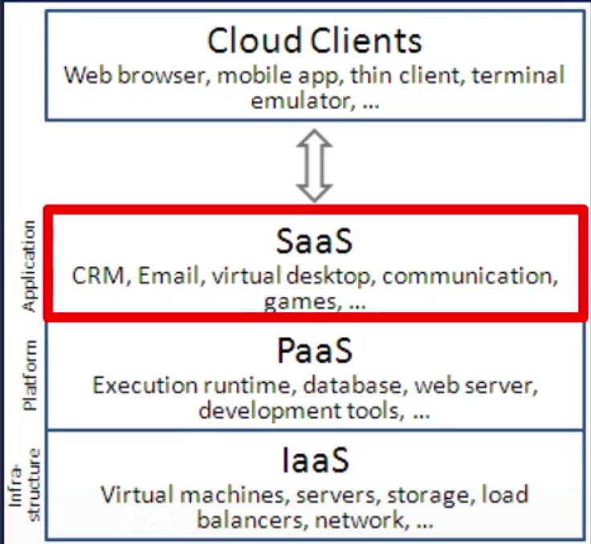

最近在coursera上学习UCSD的BigData课程。第一门课Introduction to Big Data，三周的课程，做个小结。

<!--more-->

# Six V of BigData

Five Dimensions
* Volume = Size
* Velocity = Speed
* Variety = Complexity
* Veracity = Quality
* Valence = Connectedness
Sixth : Value

# Five P of DataScience
* People
* Purpose
* Process
* Platform
* Programmability
 

# Hadoop EcoSystem
* HDFS:
     Distributed file system as foundation.
     Scalable storage; Fault tolerance.
* YARN:
     Flexible scheduling and  resource management
* MapReduce:
     Simplified programming model
     Map -> apply()
     Reduce -> summarize()
* Hive&Pig:
     Higher-level programming models
     Pig = dataflow scripting
     Hive = SQL-like queries
* Storm&Spark&Flink
     Real-time(实时) and in-memory(内存) processing
* NoSQL:
     HBase; Cassandra; MongoDB
* Zookeeper: management
     Synchronization; Configuration; High-availability
 

## HDFS 
NameNode&DataNode
 

## YARN(Yet Another Resource Negotiator)
The Resource Manager for Hadoop
 
	
## MapReduce
Map = apply operation to all Elements   计算
Reduce = summarize operation on Elements 总结
 

## Hadoop CAUTION！
* Small Datasets	太小
* Advanced Algorithms	太复杂
* Infrastructure Replacement	基础数据
* Task Level Parallelism
* Random Data Access

## CloudComputing
 