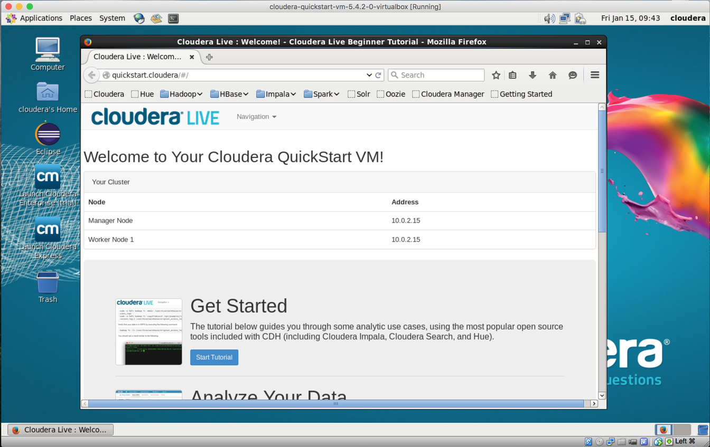

Hadoop的简单部署，以及HelloWorld程序运行。
<!--more-->

# Cloudera VM
1. Install VirtualBox. 
去[官网](https://www.virtualbox.org/wiki/Downloads)下载最新的VirtualBox，并安装。
2. Install the Cloudera VM. 
* 下载Cloudera VM虚拟机文件 [cloudera-quickstart-vm-5.4.2-0-virtualbox.zip](https://downloads.cloudera.com/demo_vm/virtualbox/cloudera-quickstart-vm-5.4.2-0-virtualbox.zip)
* 解压缩后，启动VirtualBox，选择Import导入虚拟机。
* 启动虚拟机。
* 注意：WIN10系统可能需要在WINDOWS功能中禁用Hyper X，以解决和VT-X冲突的问题。
* 启动完成
第一次启动可能需要等待较长时间，可以在虚拟机中切换查看后台，正常运行等待即可。


# Copy ur data to the HDFS
1. 在浏览器中下载需要被计算的WordCount文件  [t8.shakespeare.txt](http://ocw.mit.edu/ans7870/6/6.006/s08/lecturenotes/files/t8.shakespeare.txt)
2. 打开TERMINAL，进行一些HDFS基本操作
```bash
	cd Downloads
	hadoop fs –copyFromLocal words.txt
	hadoop fs –ls 
	hadoop fs -cp words.txt words2.txt 
	hadoop fs -ls
	hadoop fs -copyToLocal words2.txt 
	hadoop fs -rm words2.txt
	hadoop fs –ls 
```
# Run the WordCount program
1. 查看hadoop-examples给的例子都有哪些功能，其中wordcount就是我们下面使用的"helloworld"
```bash
	[cloudera@quickstart Downloads]$ hadoop jar /usr/jars/hadoop-examples.jar 
	An example program must be given as the first argument.
	Valid program names are:
	  aggregatewordcount: An Aggregate based map/reduce program that counts the words in the input files.
	  aggregatewordhist: An Aggregate based map/reduce program that computes the histogram of the words in the input files.
	  bbp: A map/reduce program that uses Bailey-Borwein-Plouffe to compute exact digits of Pi.
	  dbcount: An example job that count the pageview counts from a database.
	  distbbp: A map/reduce program that uses a BBP-type formula to compute exact bits of Pi.
	  grep: A map/reduce program that counts the matches of a regex in the input.
	  join: A job that effects a join over sorted, equally partitioned datasets
	  multifilewc: A job that counts words from several files.
	  pentomino: A map/reduce tile laying program to find solutions to pentomino problems.
	  pi: A map/reduce program that estimates Pi using a quasi-Monte Carlo method.
	  randomtextwriter: A map/reduce program that writes 10GB of random textual data per node.
	  randomwriter: A map/reduce program that writes 10GB of random data per node.
	  secondarysort: An example defining a secondary sort to the reduce.
	  sort: A map/reduce program that sorts the data written by the random writer.
	  sudoku: A sudoku solver.
	  teragen: Generate data for the terasort
	  terasort: Run the terasort
	  teravalidate: Checking results of terasort
	  wordcount: A map/reduce program that counts the words in the input files.
	  wordmean: A map/reduce program that counts the average length of the words in the input files.
	  wordmedian: A map/reduce program that counts the median length of the words in the input files.
	  wordstandarddeviation: A map/reduce program that counts the standard deviation of the length of the words in the input files.
```
2. 查看wordcount的用法
```bash
	[cloudera@quickstart Downloads]$ hadoop jar /usr/jars/hadoop-examples.jar wordcount
	Usage: wordcount <in> [<in>...] <out>
```
3. 运行"helloworld"
```bash
	[cloudera@quickstart Downloads]$ hadoop jar /usr/jars/hadoop-examples.jar wordcount words.txt out
	17/05/23 02:36:16 INFO client.RMProxy: Connecting to ResourceManager at /0.0.0.0:8032
	17/05/23 02:36:17 INFO input.FileInputFormat: Total input paths to process : 1
	17/05/23 02:36:17 INFO mapreduce.JobSubmitter: number of splits:1
	17/05/23 02:36:17 INFO mapreduce.JobSubmitter: Submitting tokens for job: job_1495517778069_0001
	17/05/23 02:36:17 INFO impl.YarnClientImpl: Submitted application application_1495517778069_0001
	17/05/23 02:36:17 INFO mapreduce.Job: The url to track the job: http://quickstart.cloudera:8088/proxy/application_1495517778069_0001/
	17/05/23 02:36:17 INFO mapreduce.Job: Running job: job_1495517778069_0001
	17/05/23 02:36:29 INFO mapreduce.Job: Job job_1495517778069_0001 running in uber mode : false
	17/05/23 02:36:29 INFO mapreduce.Job:  map 0% reduce 0%
	17/05/23 02:36:39 INFO mapreduce.Job:  map 100% reduce 0%
	17/05/23 02:36:50 INFO mapreduce.Job:  map 100% reduce 100%
	17/05/23 02:36:50 INFO mapreduce.Job: Job job_1495517778069_0001 completed successfully
	17/05/23 02:36:50 INFO mapreduce.Job: Counters: 49
		File System Counters
			FILE: Number of bytes read=978916
			FILE: Number of bytes written=2178931
			FILE: Number of read operations=0
			FILE: Number of large read operations=0
			FILE: Number of write operations=0
			HDFS: Number of bytes read=5458319
			HDFS: Number of bytes written=717768
			HDFS: Number of read operations=6
			HDFS: Number of large read operations=0
			HDFS: Number of write operations=2
		Job Counters 
			Launched map tasks=1
			Launched reduce tasks=1
			Data-local map tasks=1
			Total time spent by all maps in occupied slots (ms)=7828
			Total time spent by all reduces in occupied slots (ms)=8094
			Total time spent by all map tasks (ms)=7828
			Total time spent by all reduce tasks (ms)=8094
			Total vcore-seconds taken by all map tasks=7828
			Total vcore-seconds taken by all reduce tasks=8094
			Total megabyte-seconds taken by all map tasks=8015872
			Total megabyte-seconds taken by all reduce tasks=8288256
		Map-Reduce Framework
			Map input records=124456
			Map output records=901325
			Map output bytes=8546434
			Map output materialized bytes=978916
			Input split bytes=120
			Combine input records=901325
			Combine output records=67505
			Reduce input groups=67505
			Reduce shuffle bytes=978916
			Reduce input records=67505
			Reduce output records=67505
			Spilled Records=135010
			Shuffled Maps =1
			Failed Shuffles=0
			Merged Map outputs=1
			GC time elapsed (ms)=146
			CPU time spent (ms)=3890
			Physical memory (bytes) snapshot=347254784
			Virtual memory (bytes) snapshot=3007184896
			Total committed heap usage (bytes)=226365440
	Shuffle Errors
		BAD_ID=0
		CONNECTION=0
		IO_ERROR=0
		WRONG_LENGTH=0
		WRONG_MAP=0
		WRONG_REDUCE=0
	File Input Format Counters 
		Bytes Read=5458199
	File Output Format Counters 
		Bytes Written=717768
```
4. 查看程序运行输出 I
out是运行结果输出目录，words.txt是我们之前上传到HDFS的输入文件
```bash
	[cloudera@quickstart Downloads]$ hadoop fs -ls
	Found 2 items
	drwxr-xr-x   - cloudera cloudera          0 2017-05-23 02:36 out
	-rw-r--r--   1 cloudera cloudera    5458199 2017-05-22 22:40 words.txt

```
5. 查看程序运行输出 II
_SUCCESS代表运行结果为成功，part-r-00000为输出结果文件
```bash
	[cloudera@quickstart Downloads]$ hadoop fs -ls out
	Found 2 items
	-rw-r--r--   1 cloudera cloudera          0 2017-05-23 02:36 out/_SUCCESS
	-rw-r--r--   1 cloudera cloudera     717768 2017-05-23 02:36 out/part-r-00000

```
6. 查看程序运行输出 III
将结果文件复制到本地，查看文件
```bash
	[cloudera@quickstart Downloads]$ hadoop fs -copyToLocal out/part-r-00000 local.txt
	[cloudera@quickstart Downloads]$ more local.txt 
	"	241
	"'Tis	1
	"A	4
	"AS-IS".	1
	"Air,"	1
	"Alas,	1
	"Amen"	2
	"Amen"?	1
	"Amen,"	1
	"And	1
	"Aroint	1
	"B	1
	"Black	1
	"Break	1
	"Brutus"	1
	"Brutus,	2
	"C	1
	"Caesar"?	1
	"Caesar,	1
	"Caesar."	2
	"Certes,"	1
	"Come	1
	"Cursed	1
	"D	1
	"Darest	1
	"Defect"	1
	"Do	1
	"E	1
	"Fear	2
	"Fly,	1
	"Gentle	1
	"Give	2
	"Glamis	1
	"God	2
	"Good	1
	"Havoc!"	1
	"He	1
	"Help	1
	"Help,	2
	"Here	1
	"Hold,	2
	"I	4


```


