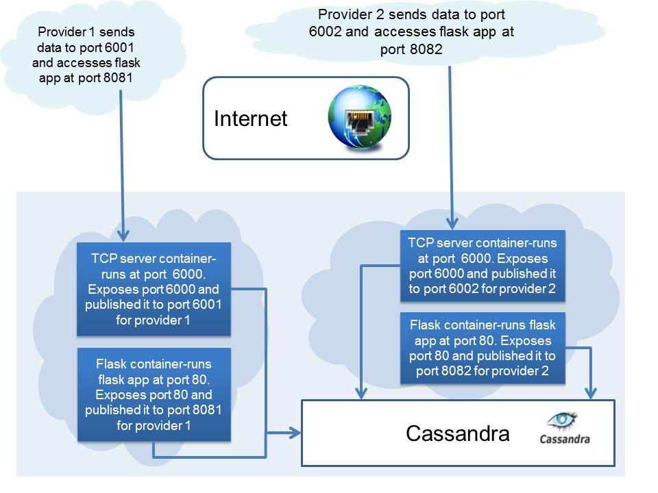

Flux7博客看到的Docker在iot的应用。

<!--more-->

[原文地址](http://blog.flux7.com/blogs/docker/using-docker-for-quick-and-easy-multi-tenancy)。

最近在Flux7实验室，我们开发了一个端到端物联网项目，接收传感器数据，向服务提供商的最终用户提供报告。我们的客户要求我们支持多家服务提供商进行新的业务。我们知道，重新构建应用程序以，加入重大改变，这样做对我们的客户来说费时费力。不仅如此，它还需要一个复杂，不灵活，难以维护的代码库。

我们一直在探索使用容器技术Docker的潜力来建立Flux7实验室的内部开发环境，并根据我们的发现，相信我们可以使用它来避免主要的应用程序重写。因此，我们决定使用Docker容器，给每个服务提供商在应用层运行多个实例，创建独立的环境来提供快速、简单、便宜的“多租户”技术（单一软件程序为多个客户服务的架构）。

# What's Docker
Docker在Linux容器（LXCs）的顶层，提供了“用户友好”的一层。 LXCs通过限制一个进程的资源，提供了操作系统级的虚拟化。除了使用chroot命令来改变给定的进程中访问的目录的权限，Docker有效地提供了一个进程组和其他文件和系统进程的隔离，而无需运行另一个操作系统的开销。

# In the Beginning
“single provider”版本的程序一般由3部分组成：
    
1. Cassandra用于数据持久性，我们稍后会用来生成每个网关的报告。
2. 一个基于Twisted的TCP_Svr,在6000端口监听来自提供商的多个网关的数据。
3.一个基于Flask的app在80端口，给用户提供管理、配置、查看报表的服务。

过去，我们使用以下方式启动"SingleProvider"单一提供商版本的服务。所有代码在Cassandra的分布式框架下都很难部署。

 

# Our New Approach
尽管Docker是一个有趣的新兴技术容器，它仍然处于发展的初级阶段。正如预期的那样，它有尚待解决的问题。对于我们来说，最大的问题是，Docker不能支持在一台机器上运行多个Cassandra 实例。因此，我们不能使用Cassandra 提供“multi-tenancy”技术。我们的另一个问题是，在一台机器上托管多个数据库实例会迅速造成资源短缺。

我们讨论的是通过传统的方式解决“multi-tenancy”技术。
1. 使用Cassandra KEYSPACE作为提供商的数据存储的命名空间。
2. 对于数据采集和Web服务器进行了对应的代码修改出，增加了数据库访问的密钥空间参数。
3. 通过命令行给各应用实例传Cassandra KEYSPACE（供应商ID），让它可以在未来使用自定义外观和其他功能。

因此，我们可以不需要更改家庭模式，而是在数据存储为每个创造一个单独的命名空间。

我们的方法的优点是，通过使用Docker提供“multi-tenancy”技术，唯一需要的代码修改就是上面那些Cassandra KEYSPACE。如果我们不使用Docker，我们就不得不做出大量的代码更改，重写应用程序。

# How We Did It - Multi Tenant Database Architecture

 

1. 创建一个Docker容器，设置了对应的环境和依赖关系。
2. 启动一个Cassandra的容器。

尽管我们没有运行Cassandra的多个实例，我们想要充分利用Docker的安全、管理和易于配置的特点。您可以从Github下载我们的Cassandra文件。我们在端口9160运行容器，使用以下命令：

2.1 使用pycassaShell创建一个密钥空间“provider1”。
2.2 在两个独立的容器启动我们的两个代码库

        Voila! We had a provider1 instance running in no time.

# Automation

用Docker-py自动化这些步骤、使用

为完善解决方案，我们为每一个新的提供商分配一个端口，并创造Cassandra keyspaces。

# Conclusion

我们很快就为我们的客户端提供了一个解决方案，基于“在每个容器空间运行对应的提供商程序”。我们不能使用虚拟机来提供该功能，因为虚拟机需要太多的资源和太多的专用内存。事实上，谷歌正在从使用虚拟机转换过来，已经成为Linux容器最大的贡献者之一，并形成了Docker的基础技术。我们可以使用多个实例，但随后我们会显著地过量分配资源。修改应用程序也会增加不必要的复杂性，成本和实施时间。

在最后，客户非常高兴，我们开发出满足他的确切需求的解决方案，同时也为他节省了钱。我们也很高兴，我们创造了可应用于未来客户需求的解决方案。